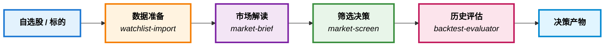
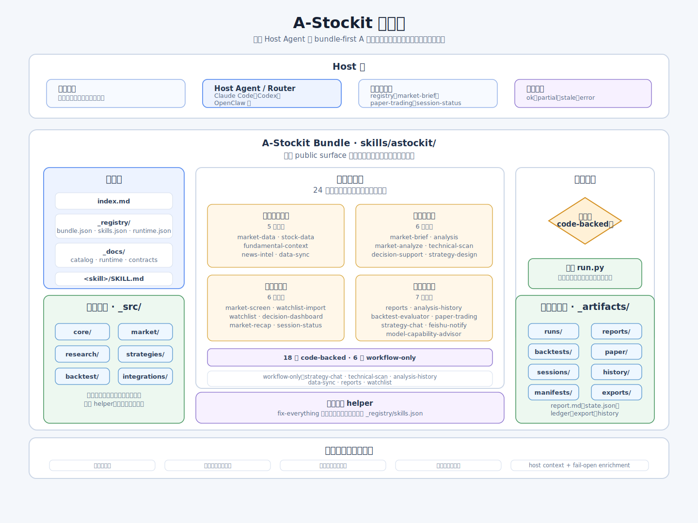
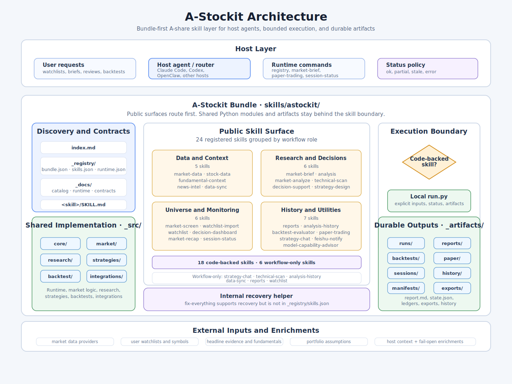

# 📈 A-Stockit

<div align="center">

**AI-Native A-Share Research & Decision Workflow**

*Transform scattered market data into organized, actionable investment insights*


[中文](#中文) | [English](#english)

---

> **⚠️ 早期访问提示 / Early Access Notice**
>
> A-Stockit 目前正在积极开发中。虽然核心功能可用，但你可能会遇到不完整的特性、bug 或破坏性变更。我们欢迎你的反馈和贡献，帮助改进项目！
>
> A-Stockit is currently in active development. While core features are functional, you may encounter incomplete features, bugs, or breaking changes. We welcome your feedback and contributions to help improve the project!

> **⭐ 支持本项目 / Support This Project**
>
> 如果你觉得 A-Stockit 有用，请考虑给它一个 star！你的支持激励我们继续开发，也帮助其他人发现这个工具。谢谢！🙏
>
> If you find A-Stockit useful, please consider giving it a star! Your support motivates us to continue development and helps others discover this tool. Thank you! 🙏

</div>

---

## 中文

### 🎯 A-Stockit 是什么？

A-Stockit 是一个 **AI 原生的技能包**，它彻底改变了你研究和决策 A 股市场的方式。不再需要在多个工具间切换或手动整理数据，你将获得一个完整的工作流：自选股管理、行情分析、技术解读、决策支持——全部通过与 Agent 框架的自然对话完成。

**兼容框架**：Claude Code、OpenClaw、Codex 等主流 Agent 框架

### 👥 适合谁使用？

- **普通投资者**：关注 A 股市场，希望用 AI 辅助观察和复盘
- **活跃交易者**：需要自选股管理、筛选、简报和决策判断的独立研究者
- **量化研究者**：希望把研究流程做成可复用、可回测的产物
- **开发者**：需要为 Agent 框架接入 A 股能力的框架开发者

### 💡 解决的问题

**问题 1：能力碎片化** 🧩
通用 Agent 能聊天、写代码、调用工具，但不知道如何把 `自选股`、`行情快照`、`技术解读`、`决策建议`、`复盘` 串成稳定的 A 股工作流。A-Stockit 提供完整的技能定义和执行器。

**问题 2：数据分散** 📊
A 股数据、新闻、基本面、执行计划和历史产物经常分散在不同脚本、笔记和聊天上下文中。A-Stockit 统一管理所有产物，便于检索和复盘。

**问题 3：缺乏可复用性** 🔄
用户需要的往往不是”自动交易机器人”，而是一个能被现有 Agent 可靠调用、可复查、可复用的 A 股能力包。A-Stockit 采用 `bundle-first`、`definition-first` 设计。

**问题 4：历史断层** ⏳
研究和决策过程缺乏持久化，无法回溯历史分析或评估策略效果。A-Stockit 保存所有运行产物，支持历史检索和回测评估。

---

### ✨ 核心特性

- **📦 24 个公开技能**：覆盖数据准备、市场解读、筛选决策、历史评估全流程
- **🤖 18 个代码化执行器**：核心能力已实现，开箱即用
- **📋 6 个工作流定义**：稳定的流程指导，可按需实现
- **🗂️ 统一产物管理**：所有运行结果落在 `_artifacts/`，支持历史检索
- **🔄 可回测架构**：Paper trading 和回测评估能力内置
- **🎨 AI 原生工作流**：为主流 Agent 框架设计——通过自然语言工作，而非 CLI 命令

---

### 🚀 快速开始

#### 安装

```bash
# 克隆仓库
git clone https://github.com/yourusername/A-Stockit.git
cd A-Stockit

# 根据你使用的 Agent 框架进行安装：

# Claude Code (项目级):
mkdir -p .claude/skills
ln -s $(pwd)/skills/astockit .claude/skills/astockit

# Claude Code (用户级):
mkdir -p ~/.claude/skills
ln -s $(pwd)/skills/astockit ~/.claude/skills/astockit

# OpenClaw (项目级):
mkdir -p skills
ln -s $(pwd)/skills/astockit skills/astockit

# Codex (项目级):
mkdir -p .agents/skills
ln -s $(pwd)/skills/astockit .agents/skills/astockit
```

#### 验证安装

打开你的 Agent 框架，输入：

```
“列出 astockit 技能”
```

如果看到技能列表，说明安装成功！

#### 第一次使用

**导入自选股：**

```
“导入自选股：600519,300750,000858”
```

AI 助手会：
1. 解析股票代码
2. 验证代码有效性
3. 保存到 `_artifacts/sessions/watchlist.json`
4. 返回导入结果

**获取市场简报：**

```
“给我 600519 的市场简报”
```

AI 助手会：
1. 获取实时行情数据
2. 分析技术指标
3. 生成可读的市场简报
4. 保存到 `_artifacts/reports/`

**筛选自选股：**

```
“筛选我的自选股，找出最值得关注的 3 只”
```

AI 助手会分析所有自选股并给出排序建议。

**查看决策面板：**

```
“显示决策面板”
```

AI 助手会综合展示当前市场状态、自选股表现和决策建议。

#### 常见使用场景

**场景 1：日常复盘**
```
“导入自选股：600519,300750,000858”
“生成今日市场复盘”
“分析自选股表现”
```

**场景 2：技术分析**
```
“对 600519 进行技术扫描”
“分析 300750 的技术指标”
“比较这两只股票的技术面”
```

**场景 3：策略回测**
```
“设计一个均线策略”
“对 600519 进行回测”
“评估回测结果”
```

---

### 📋 工作流概览



**工作流说明：**
- **数据准备**: 导入自选股、获取市场数据、同步基本面信息
- **市场解读**: 生成行情简报、技术指标分析、新闻情报整合
- **筛选决策**: 多维度筛选、决策支持建议、策略设计
- **历史评估**: Paper trading、回测分析、生成报告

---

### 🛠️ 架构设计

根据当前仓库状态，A-Stockit 更准确的说法是：它由 **四个公开 surface、一个共享实现 surface，以及一个持久化产物 surface** 组成。

```text
skills/astockit/
├── index.md               # bundle 级定位、路由默认值、边界说明
├── _registry/             # 机器可读元数据
│   ├── bundle.json
│   ├── runtime.json
│   ├── skills.json
│   └── strategies.json
├── _docs/                 # 说明文档、接口定义、运行时文档、作者指南
│   ├── authoring/
│   ├── audit/
│   ├── contracts/
│   ├── runtime/
│   └── skills/
├── _src/                  # 共享 Python 实现
│   ├── core/              # 配置、注册表、运行时、存储
│   ├── market/            # 行情、看板、自选股、基本面上下文
│   ├── research/          # 分析、新闻、评估、paper trading 逻辑
│   ├── strategies/        # 策略预设与信号逻辑
│   ├── backtest/          # 回测模型与引擎
│   └── integrations/      # 对外通知能力
├── _artifacts/            # 会话状态、运行产物、清单与导出物
│   ├── backtests/
│   ├── exports/
│   ├── history/
│   ├── manifests/
│   ├── paper/
│   ├── reports/
│   ├── runs/
│   └── sessions/
└── <skill>/               # 单个技能目录
    ├── SKILL.md           # 公开技能定义
    └── run.py             # 仅在 code-backed 技能存在
```

下图用更紧凑的方式概括公开 surface、执行边界和持久化产物流向：



当前 bundle 状态可以直接从仓库中验证：

- **24 个公开注册技能 + 1 个内部恢复 helper（`fix-everything`）**
- **18 个 code-backed 技能执行器**
- **6 个 workflow-only 技能定义**
- **20 个 runtime 命令注册项**

也就是说，A-Stockit 现在既不是“只有提示词的技能集”，也不是“只靠 Python API 的库”，而是一个同时提供路由定义、运行时实现和持久化产物的完整技能 bundle；`fix-everything` 作为内部恢复 helper 存在，但不计入公开技能面。

更详细的边界与路由说明见 [skills/astockit/index.md](skills/astockit/index.md)。

### 当前技能覆盖面

当前公开技能面加上内部恢复 helper，大致覆盖以下几类 A 股工作流：

- **标的整理与数据准备**：`watchlist-import`, `watchlist`, `market-data`, `stock-data`, `fundamental-context`, `data-sync`
- **解读与研究**：`market-brief`, `analysis`, `market-analyze`, `technical-scan`, `news-intel`, `market-recap`
- **筛选、决策与执行规划**：`market-screen`, `decision-support`, `decision-dashboard`, `strategy-design`, `paper-trading`
- **历史、评估与运维**：`analysis-history`, `backtest-evaluator`, `reports`, `session-status`, `strategy-chat`, `feishu-notify`, `model-capability-advisor`
- **内部恢复**：`fix-everything`

完整目录见 [skills/astockit/_docs/skills/index.md](skills/astockit/_docs/skills/index.md)。

---

### 🗺️ 开发路线图

#### ✅ 已完成

- [x] 核心技能框架和注册表系统
- [x] 18 个代码化技能执行器
- [x] 统一产物管理和持久化
- [x] 基础市场数据获取和分析
- [x] 自选股管理和筛选
- [x] Paper trading 和回测评估框架
- [x] 飞书通知集成

#### 🚧 进行中

- [ ] 完善剩余 6 个工作流定义的代码实现
- [ ] 增强技术指标分析能力
- [ ] 优化回测引擎性能
- [ ] 改进新闻情报整合
- [ ] 添加更多策略预设

#### 📋 计划中

- [ ] Web 可视化界面
- [ ] 更多数据源支持
- [ ] 实时行情推送
- [ ] 多账户管理
- [ ] 社区策略分享平台
- [ ] 移动端支持

> **💡 提示**: 路线图会根据社区反馈和实际需求动态调整。如果你有建议或需求，欢迎在 [Issues](https://github.com/yourusername/A-Stockit/issues) 中提出！

---

### 📚 文档

- [skills/astockit/index.md](skills/astockit/index.md)：bundle 级路由、边界和设计目标
- [skills/astockit/_docs/contracts/runtime-interface.md](skills/astockit/_docs/contracts/runtime-interface.md)：运行时接口定义
- [skills/astockit/_docs/authoring/quant-workflow-framework.md](skills/astockit/_docs/authoring/quant-workflow-framework.md)：工作流框架

### 直接使用本仓库或参与开发

对于开发者或具有相关技术背景的用户，如果你希望直接使用本仓库，或者参与本项目开发，可以选择通过 `pip` 安装本仓库。

```bash
python -m pip install -e .
```

按需安装可选依赖：

```bash
python -m pip install -e .[a_share]
python -m pip install -e .[feishu]
python -m pip install -e .[a_share,feishu]
```

这样就可以直接使用本地执行入口：

```bash
python3 skills/astockit/market-brief/run.py 600519 --source auto
python3 skills/astockit/market-screen/run.py 600519 300750 000858 --top 3
python3 skills/astockit/watchlist-import/run.py --text "600519,300750,000858"
```

这部分不建议作为没有相关技术背景的用户的首选入口，更推荐通过现有 Agent 框架调用 A-Stockit。

---

### ❓ 常见问题

#### 什么是 A-Stockit？

A-Stockit 是一个为 Agent 框架设计的 A 股技能包，用于市场研究、决策支持和策略回测。它不是传统的库或工具，而是通过自然语言对话工作的 AI 原生工作流。

#### 我需要编程经验吗？

不需要。你只需要与 AI 助手自然对话即可使用 A-Stockit。如果你想参与开发或直接调用 Python 代码，则需要相关技术背景。

#### A-Stockit 会自动交易吗？

不会。A-Stockit 是研究和决策辅助工具，不会自动执行交易。所有决策建议都需要人工审核和确认。

#### 数据从哪里来？

A-Stockit 使用 AKShare 等开源数据源获取 A 股市场数据。数据质量取决于这些数据源的可靠性。

#### 数据存储在哪里？

所有数据都存储在你的本地文件系统中的 `_artifacts/` 目录。A-Stockit 不会将数据发送到任何外部服务器（除了获取市场数据的数据源）。

#### 如何备份我的研究产物？

只需备份整个项目目录，特别是 `_artifacts/` 目录，其中包含所有会话状态、报告和历史记录。

#### 如何添加新技能？

参见下方的贡献指南。基本步骤：
1. 在 `skills/astockit/` 创建新技能目录
2. 编写 `SKILL.md` 定义工作流
3. 如需代码化，添加 `run.py` 执行器
4. 在 `_registry/skills.json` 中注册
5. 编写测试和文档

#### 遇到问题怎么办？

- 查看 [Issues](https://github.com/yourusername/A-Stockit/issues) 寻找类似问题
- 创建新的 [Bug 报告](https://github.com/yourusername/A-Stockit/issues/new?template=bug_report.md)
- 加入 [讨论区](https://github.com/yourusername/A-Stockit/discussions) 提问

#### 已知限制

作为早期访问项目，A-Stockit 目前存在以下已知限制：

- **数据源依赖**: 依赖第三方开源数据源（如 AKShare），数据可用性和质量受其影响
- **部分技能未完成**: 6 个技能仍为工作流定义，尚未代码化
- **性能优化**: 回测引擎和大规模数据处理性能仍在优化中
- **文档完善度**: 部分高级功能的文档仍在编写中
- **测试覆盖**: 单元测试覆盖率仍在提升中

我们正在积极改进这些方面。如果你遇到问题或有改进建议，欢迎通过 Issues 反馈！

---

### 🤝 贡献指南

我们欢迎所有形式的贡献！无论是新功能、bug 修复、文档改进还是使用反馈，都能帮助 A-Stockit 变得更好。

#### 贡献方式

**1. 添加新技能** 🎯
- 在 `skills/astockit/` 下创建新的技能目录
- 编写 `SKILL.md` 定义工作流逻辑
- 如需代码化，实现 `run.py` 执行器
- 在 `_registry/skills.json` 中注册技能
- 编写测试验证技能行为

**2. 改进数据源** 📊
- 优化 `_src/market/` 中的数据获取逻辑
- 添加新的数据源支持
- 提升数据质量和可靠性

**3. 增强分析能力** 📈
- 改进 `_src/research/` 中的分析模块
- 添加新的技术指标
- 优化决策支持算法

**4. 完善回测引擎** 🔄
- 优化 `_src/backtest/` 中的回测逻辑
- 添加新的评估指标
- 提升回测性能

**5. 文档和示例** 📖
- 补充使用场景和最佳实践
- 添加常见问题解答
- 提供更多示例

#### 提交 Pull Request

在提交 PR 之前，请确保：

1. **代码质量**
   - 遵循项目现有的代码风格
   - 添加必要的类型注解和文档字符串
   - 确保代码通过所有测试

2. **测试覆盖**
   ```bash
   # 运行测试（如果有）
   pytest
   ```
   - 为新功能添加单元测试
   - 确保现有测试全部通过
   - 测试覆盖关键路径和边界情况

3. **提交信息**
   - 使用清晰的提交信息描述变更
   - 格式：`<type>(<scope>): <subject>`
   - 类型：`feat`, `fix`, `docs`, `style`, `refactor`, `test`, `chore`
   - 示例：
     ```
     feat(skills): add fundamental-analysis skill
     fix(market): handle missing data gracefully
     docs(readme): update installation instructions
     ```

4. **PR 描述**
   - 清楚说明变更的动机和目标
   - 列出主要变更点
   - 附上相关的 issue 编号（如有）
   - 提供测试步骤或截图（如适用）

#### PR 模板

```markdown
## 变更类型
- [ ] 新功能
- [ ] Bug 修复
- [ ] 文档更新
- [ ] 性能优化
- [ ] 代码重构

## 变更描述
<!-- 简要描述这个 PR 做了什么 -->

## 动机和背景
<!-- 为什么需要这个变更？解决了什么问题？ -->

## 测试
<!-- 如何验证这个变更？提供测试步骤 -->

## 相关 Issue
<!-- 关联的 issue 编号，如 #123 -->

## 检查清单
- [ ] 代码遵循项目风格指南
- [ ] 添加了必要的测试
- [ ] 所有测试通过
- [ ] 更新了相关文档
- [ ] 提交信息清晰明确
```

#### 开发环境设置

```bash
# 克隆仓库
git clone https://github.com/yourusername/A-Stockit.git
cd A-Stockit

# 安装依赖
python -m pip install -e .[a_share,feishu]

# 运行测试
pytest

# 安装到 Agent 框架进行测试
mkdir -p ~/.claude/skills
ln -s $(pwd)/skills/astockit ~/.claude/skills/astockit
```

#### 行为准则

- 尊重所有贡献者
- 保持建设性的讨论
- 接受建设性的批评
- 关注对项目最有利的事情
- 对社区成员表现出同理心

#### 需要帮助？

- 查看 [Issues](https://github.com/yourusername/A-Stockit/issues) 寻找可以贡献的任务
- 标记为 `good first issue` 的问题适合新贡献者
- 标记为 `help wanted` 的问题需要社区帮助
- 有疑问？在 issue 中提问或发起讨论

更多详情请阅读 [CONTRIBUTING.md](CONTRIBUTING.md) 和 [CODE_OF_CONDUCT.md](CODE_OF_CONDUCT.md)。

---

### 📄 许可证

本项目采用 [MIT License](LICENSE)。

---

## English

### 🎯 What is A-Stockit?

A-Stockit is an **AI-native skill pack** that transforms how you research and make decisions in the A-share market. No more switching between multiple tools or manually organizing data—you get a complete workflow: watchlist management, market analysis, technical interpretation, decision support—all through natural conversation with your AI assistant.

**Compatible Frameworks**: Claude Code, OpenClaw, Codex, and other mainstream agent frameworks

### 👥 Who Should Use This?

- **Everyday Investors**: A-share market followers who want AI-assisted observation and review
- **Active Traders**: Independent researchers who need watchlist management, screening, briefings, and decision framing
- **Quant Researchers**: Those who want reproducible, backtestable research workflows
- **Developers**: Framework developers who need to integrate A-share capabilities into agent frameworks

### 💡 Problems It Solves

**Problem 1: Fragmented Capabilities** 🧩
General-purpose agents can chat, write code, and call tools, but don't know how to string together `watchlists`, `market snapshots`, `technical reads`, `decision guidance`, and `retrospectives` into a stable A-share workflow. A-Stockit provides complete skill definitions and executors.

**Problem 2: Scattered Data** 📊
A-share data, news, fundamentals, execution plans, and historical artifacts are often scattered across scripts, notes, and conversation context. A-Stockit manages all artifacts in one place for easy retrieval and review.

**Problem 3: Lack of Reusability** 🔄
Users often don't want an "auto-trading bot" but an A-share capability bundle that existing agents can reliably call, inspect, and reuse. A-Stockit adopts a `bundle-first`, `definition-first` design.

**Problem 4: Historical Gap** ⏳
Research and decision processes lack persistence, making it impossible to trace historical analysis or evaluate strategy effectiveness. A-Stockit saves all run artifacts, supporting historical retrieval and backtest evaluation.

---

### ✨ Key Features

- **📦 24 Public Skills**: Covering data prep, market interpretation, screening & decisions, historical evaluation
- **🤖 18 Code-Backed Executors**: Core capabilities implemented and ready to use
- **📋 6 Workflow Definitions**: Stable process guidance, implementable as needed
- **🗂️ Unified Artifact Management**: All run results stored in `_artifacts/`, supporting historical retrieval
- **🔄 Backtestable Architecture**: Paper trading and backtest evaluation built-in
- **🎨 AI-Native Workflow**: Designed for mainstream agent frameworks—work through natural language, not CLI commands

---

### 🚀 Quick Start

#### Installation

```bash
# Clone the repository
git clone https://github.com/yourusername/A-Stockit.git
cd A-Stockit

# Install based on your agent framework:

# Claude Code (project-level):
mkdir -p .claude/skills
ln -s $(pwd)/skills/astockit .claude/skills/astockit

# Claude Code (user-level):
mkdir -p ~/.claude/skills
ln -s $(pwd)/skills/astockit ~/.claude/skills/astockit

# OpenClaw (project-level):
mkdir -p skills
ln -s $(pwd)/skills/astockit skills/astockit

# Codex (project-level):
mkdir -p .agents/skills
ln -s $(pwd)/skills/astockit .agents/skills/astockit
```

#### Verify Installation

Open your agent framework and type:

```
"List astockit skills"
```

If you see the skill list, installation is successful!

#### First Use

**Import watchlist:**

```
"Import watchlist: 600519,300750,000858"
```

Your AI assistant will:
1. Parse stock codes
2. Validate code validity
3. Save to `_artifacts/sessions/watchlist.json`
4. Return import results

**Get market brief:**

```
"Give me a market brief for 600519"
```

Your AI assistant will:
1. Fetch real-time market data
2. Analyze technical indicators
3. Generate readable market brief
4. Save to `_artifacts/reports/`

**Screen watchlist:**

```
"Screen my watchlist and find the top 3 most noteworthy stocks"
```

Your AI assistant will analyze all watchlist stocks and provide ranking recommendations.

**View decision dashboard:**

```
"Show decision dashboard"
```

Your AI assistant will comprehensively display current market status, watchlist performance, and decision recommendations.

#### Common Use Cases

**Scenario 1: Daily Review**
```
"Import watchlist: 600519,300750,000858"
"Generate today's market recap"
"Analyze watchlist performance"
```

**Scenario 2: Technical Analysis**
```
"Perform technical scan on 600519"
"Analyze technical indicators for 300750"
"Compare the technicals of these two stocks"
```

**Scenario 3: Strategy Backtesting**
```
"Design a moving average strategy"
"Backtest on 600519"
"Evaluate backtest results"
```

---

### 📋 Workflow Overview

```mermaid
flowchart LR
    A["<b>Watchlist/Tickers</b>"] --> B["<b>Data Prep</b><br/><i>watchlist-import</i>"]
    B --> C["<b>Market Interpretation</b><br/><i>market-brief</i>"]
    C --> D["<b>Screening & Decisions</b><br/><i>market-screen</i>"]
    D --> E["<b>Historical Evaluation</b><br/><i>backtest-evaluator</i>"]
    E --> F["<b>Decision Artifacts</b>"]

    style A fill:#e3f2fd,stroke:#1976d2,stroke-width:3px,color:#000
    style B fill:#fff3e0,stroke:#f57c00,stroke-width:3px,color:#000
    style C fill:#f3e5f5,stroke:#7b1fa2,stroke-width:3px,color:#000
    style D fill:#e8f5e9,stroke:#388e3c,stroke-width:3px,color:#000
    style E fill:#fce4ec,stroke:#c2185b,stroke-width:3px,color:#000
    style F fill:#e1f5ff,stroke:#0288d1,stroke-width:3px,color:#000
```



**Workflow Details:**
- **Data Prep**: Import watchlist, fetch market data, sync fundamentals
- **Market Interpretation**: Generate market briefs, technical indicator analysis, news intelligence integration
- **Screening & Decisions**: Multi-dimensional screening, decision support recommendations, strategy design
- **Historical Evaluation**: Paper trading, backtest analysis, generate reports

---

### 🛠️ Architecture Design

Based on the current repository state, A-Stockit is best described as **four public surfaces, one shared implementation surface, and one durable artifact surface**.

```text
skills/astockit/
├── index.md               # bundle positioning, routing defaults, boundary guide
├── _registry/             # machine-readable metadata
│   ├── bundle.json
│   ├── runtime.json
│   ├── skills.json
│   └── strategies.json
├── _docs/                 # documentation, interface definitions, runtime docs, authoring notes
│   ├── authoring/
│   ├── audit/
│   ├── contracts/
│   ├── runtime/
│   └── skills/
├── _src/                  # shared Python implementation
│   ├── core/              # config, registry, runtime, storage
│   ├── market/            # market data, dashboards, watchlists, fundamentals
│   ├── research/          # analysis, news, evaluation, paper-trading logic
│   ├── strategies/        # strategy presets and signal logic
│   ├── backtest/          # backtest models and engine
│   └── integrations/      # outbound integrations
├── _artifacts/            # session state, runs, manifests, reports, exports
│   ├── backtests/
│   ├── exports/
│   ├── history/
│   ├── manifests/
│   ├── paper/
│   ├── reports/
│   ├── runs/
│   └── sessions/
└── <skill>/               # individual skill directory
    ├── SKILL.md           # public skill definition
    └── run.py             # only for code-backed skills
```

The diagram below summarizes the same surfaces, execution boundary, and artifact flow in a lower-density layout:



The live bundle state can be verified directly from the repo:

- **24 public registered skills + 1 internal recovery helper (`fix-everything`)**
- **18 code-backed executors**
- **6 workflow-only skill definitions**
- **20 runtime command registrations**

That means A-Stockit is no longer just a prompt bundle and it is also not only a Python helper library. It is a full skill bundle with routing definitions, shared runtime implementation, and durable artifact storage, with `fix-everything` kept as an internal recovery helper rather than part of the public skill surface.

For the bundle-level routing and boundary guide, see [skills/astockit/index.md](skills/astockit/index.md).

### Current Skill Coverage

The current public skill surface plus the internal recovery helper broadly cover these A-share workflows:

- **Universe intake and data prep**: `watchlist-import`, `watchlist`, `market-data`, `stock-data`, `fundamental-context`, `data-sync`
- **Interpretation and research**: `market-brief`, `analysis`, `market-analyze`, `technical-scan`, `news-intel`, `market-recap`
- **Screening, decisions, and execution planning**: `market-screen`, `decision-support`, `decision-dashboard`, `strategy-design`, `paper-trading`
- **History, evaluation, and operations**: `analysis-history`, `backtest-evaluator`, `reports`, `session-status`, `strategy-chat`, `feishu-notify`, `model-capability-advisor`
- **Internal recovery**: `fix-everything`

See the full catalog in [skills/astockit/_docs/skills/index.md](skills/astockit/_docs/skills/index.md).

---

### 🗺️ Roadmap

#### ✅ Completed

- [x] Core skill framework and registry system
- [x] 18 code-backed skill executors
- [x] Unified artifact management and persistence
- [x] Basic market data fetching and analysis
- [x] Watchlist management and screening
- [x] Paper trading and backtest evaluation framework
- [x] Feishu notification integration

#### 🚧 In Progress

- [ ] Complete code implementation for remaining 6 workflow definitions
- [ ] Enhance technical indicator analysis capabilities
- [ ] Optimize backtest engine performance
- [ ] Improve news intelligence integration
- [ ] Add more strategy presets

#### 📋 Planned

- [ ] Web visualization interface
- [ ] More data source support
- [ ] Real-time market data streaming
- [ ] Multi-account management
- [ ] Community strategy sharing platform
- [ ] Mobile support

> **💡 Tip**: The roadmap is dynamically adjusted based on community feedback and actual needs. If you have suggestions or requirements, feel free to raise them in [Issues](https://github.com/yourusername/A-Stockit/issues)!

---

### 📚 Documentation

- [skills/astockit/index.md](skills/astockit/index.md): bundle routing, boundaries, and design goals
- [skills/astockit/_docs/contracts/runtime-interface.md](skills/astockit/_docs/contracts/runtime-interface.md): runtime interface definition
- [skills/astockit/_docs/authoring/quant-workflow-framework.md](skills/astockit/_docs/authoring/quant-workflow-framework.md): workflow framework

### Using The Repo Directly Or Contributing

For developers or users with a relevant technical background, if you want to use this repository directly or participate in development, you can install the repo with `pip`:

```bash
python -m pip install -e .
```

Optional extras:

```bash
python -m pip install -e .[a_share]
python -m pip install -e .[feishu]
python -m pip install -e .[a_share,feishu]
```

This path is a better fit when:

- you want to call the repo as a Python package directly
- you are contributing, debugging, or validating packaging behavior
- you want explicit local control over dependencies and extras

After that, you can directly use local executors:

```bash
python3 skills/astockit/market-brief/run.py 600519 --source auto
python3 skills/astockit/market-screen/run.py 600519 300750 000858 --top 3
python3 skills/astockit/watchlist-import/run.py --text "600519,300750,000858"
```

This is not the preferred entry path for general users. For most users, the better path is to call A-Stockit through an existing Agent.

---

### ❓ Frequently Asked Questions

#### What is A-Stockit?

A-Stockit is an A-share skill pack designed for agent frameworks, used for market research, decision support, and strategy backtesting. It's not a traditional library or tool, but an AI-native workflow that works through natural language conversation.

#### Do I need programming experience?

No. You simply talk to your AI assistant naturally to use A-Stockit. If you want to contribute to development or directly call Python code, then you need relevant technical background.

#### Will A-Stockit auto-trade?

No. A-Stockit is a research and decision support tool and will not automatically execute trades. All decision recommendations require human review and confirmation.

#### Where does the data come from?

A-Stockit uses open-source data sources like AKShare to obtain A-share market data. Data quality depends on the reliability of these data sources.

#### Where is data stored?

All data is stored on your local filesystem in the `_artifacts/` directory. A-Stockit does not send data to any external servers (except data sources for fetching market data).

#### How do I backup my research artifacts?

Simply backup the entire project directory, especially the `_artifacts/` directory, which contains all session state, reports, and historical records.

#### How do I add new skills?

See the Contributing section below. Basic steps:
1. Create new skill directory in `skills/astockit/`
2. Write `SKILL.md` to define workflow
3. If code-backing is needed, add `run.py` executor
4. Register in `_registry/skills.json`
5. Write tests and documentation

#### What if I encounter issues?

- Check [Issues](https://github.com/yourusername/A-Stockit/issues) for similar problems
- Create a new [Bug Report](https://github.com/yourusername/A-Stockit/issues/new?template=bug_report.md)
- Join [Discussions](https://github.com/yourusername/A-Stockit/discussions) to ask questions

#### Known Limitations

As an early access project, A-Stockit currently has the following known limitations:

- **Data Source Dependency**: Relies on third-party open-source data sources (e.g., AKShare), data availability and quality are affected by them
- **Incomplete Skills**: 6 skills remain as workflow definitions and are not yet code-backed
- **Performance Optimization**: Backtest engine and large-scale data processing performance are still being optimized
- **Documentation Completeness**: Documentation for some advanced features is still being written
- **Test Coverage**: Unit test coverage is still being improved

We are actively working on these areas. If you encounter issues or have improvement suggestions, please provide feedback through Issues!

---

### 🤝 Contributing

We welcome all forms of contributions! Whether it's new features, bug fixes, documentation improvements, or usage feedback, all help make A-Stockit better.

#### Ways to Contribute

**1. Add New Skills** 🎯
- Create new skill directory under `skills/astockit/`
- Write `SKILL.md` to define workflow logic
- If code-backing is needed, implement `run.py` executor
- Register skill in `_registry/skills.json`
- Write tests to verify skill behavior

**2. Improve Data Sources** 📊
- Optimize data fetching logic in `_src/market/`
- Add new data source support
- Improve data quality and reliability

**3. Enhance Analysis Capabilities** 📈
- Improve analysis modules in `_src/research/`
- Add new technical indicators
- Optimize decision support algorithms

**4. Refine Backtest Engine** 🔄
- Optimize backtest logic in `_src/backtest/`
- Add new evaluation metrics
- Improve backtest performance

**5. Documentation and Examples** 📖
- Add use cases and best practices
- Expand FAQ
- Provide more examples

#### Submitting Pull Requests

Before submitting a PR, ensure:

1. **Code Quality**
   - Follow existing project code style
   - Add necessary type annotations and docstrings
   - Ensure code passes all tests

2. **Test Coverage**
   ```bash
   # Run tests (if available)
   pytest
   ```
   - Add unit tests for new features
   - Ensure all existing tests pass
   - Test coverage for critical paths and edge cases

3. **Commit Messages**
   - Use clear commit messages describing changes
   - Format: `<type>(<scope>): <subject>`
   - Types: `feat`, `fix`, `docs`, `style`, `refactor`, `test`, `chore`
   - Examples:
     ```
     feat(skills): add fundamental-analysis skill
     fix(market): handle missing data gracefully
     docs(readme): update installation instructions
     ```

4. **PR Description**
   - Clearly explain motivation and goals of changes
   - List main change points
   - Include related issue numbers (if any)
   - Provide test steps or screenshots (if applicable)

#### PR Template

```markdown
## Change Type
- [ ] New feature
- [ ] Bug fix
- [ ] Documentation update
- [ ] Performance optimization
- [ ] Code refactoring

## Change Description
<!-- Briefly describe what this PR does -->

## Motivation and Background
<!-- Why is this change needed? What problem does it solve? -->

## Testing
<!-- How to verify this change? Provide test steps -->

## Related Issues
<!-- Related issue numbers, e.g., #123 -->

## Checklist
- [ ] Code follows project style guide
- [ ] Added necessary tests
- [ ] All tests pass
- [ ] Updated relevant documentation
- [ ] Commit messages are clear
```

#### Development Environment Setup

```bash
# Clone repository
git clone https://github.com/yourusername/A-Stockit.git
cd A-Stockit

# Install dependencies
python -m pip install -e .[a_share,feishu]

# Run tests
pytest

# Install to agent framework for testing
mkdir -p ~/.claude/skills
ln -s $(pwd)/skills/astockit ~/.claude/skills/astockit
```

#### Code of Conduct

- Respect all contributors
- Maintain constructive discussions
- Accept constructive criticism
- Focus on what's best for the project
- Show empathy towards community members

#### Need Help?

- Check [Issues](https://github.com/yourusername/A-Stockit/issues) for tasks to contribute to
- Issues marked `good first issue` are suitable for new contributors
- Issues marked `help wanted` need community help
- Have questions? Ask in issues or start a discussion

For more details, please read [CONTRIBUTING.md](CONTRIBUTING.md) and [CODE_OF_CONDUCT.md](CODE_OF_CONDUCT.md).

---

### 📄 License

This project is licensed under the [MIT License](LICENSE).

---

<div align="center">

**Built with ❤️ for AI Agent Frameworks**

*Transform scattered market data into organized, actionable investment insights*

[⬆ Back to Top](#-a-stockit)

</div>
