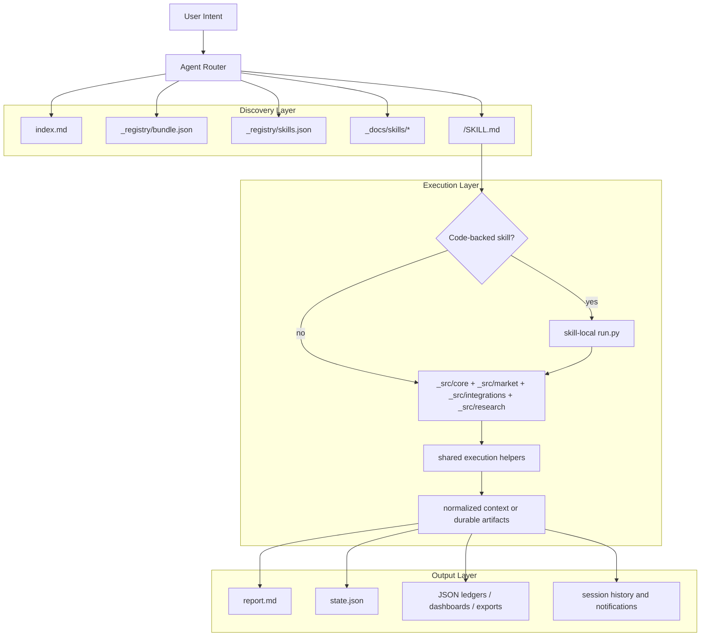

# A-Stockit Bundle Index

## Positioning

A-Stockit is an agent-facing A-share capability bundle.

It sits between:

- generic agent frameworks that need explicit skill routing
- low-level market-data and analysis helpers that are too implementation-centric to expose directly

The bundle exists to answer four questions clearly:

1. What capability surfaces does the bundle expose?
2. Which skill should be chosen for the current user intent?
3. Which skills are executable now and which are still workflow-only?
4. Where do durable outputs live once a skill runs?

## Bundle Surfaces

The bundle is organized around four explicit public surfaces plus one shared implementation surface:

- `index.md` for bundle-level positioning and routing defaults
- `_registry/` for machine-readable metadata
- `<skill>/SKILL.md` for the primary operational contract of each skill
- `_docs/` for expanded explanations and authoring guidance
- `_src/` for shared implementation support

The public API is the skill layer. `_src/` is deliberately secondary.

Quantitative workflow guidance lives in:

- `_docs/authoring/quant-workflow-framework.md`
- `_docs/authoring/workflow-integration-guide.md`
- `_docs/authoring/evidence-sufficiency.md`

## Design Goals

- Bundle-first distribution: `skills/astockit` is the deployment artifact.
- Skill-first public API: agents should start from `SKILL.md`, not by reverse-engineering Python code.
- Clear implementation boundaries: every skill must say whether it is code-backed or workflow-only.
- Research discipline over loose narration: outputs should make thesis, drivers, invalidation, and open risks explicit when the workflow claims analytical depth.
- Layer separation: descriptive analysis, decision support, execution planning, and retrospective evaluation should remain distinguishable even when a skill composes more than one layer.
- Provenance first: users should be able to tell what came from persisted artifacts, current computation, optional enrichments, and user-supplied assumptions.
- Durable outputs: artifact-producing skills should write results that downstream skills can reuse.
- Bounded reuse: session state and prior artifacts may be reused, but only under documented rules.
- Fail-open integrations: optional enrichments and notifications should degrade clearly instead of blocking the core path.
- Honest confidence: ordinal scores or heuristic confidence fields must not be presented as calibrated probabilities unless the bundle validates that claim.

## Code-Backed vs Workflow-Only

### Code-Backed Skill

A code-backed skill has a local `run.py` and may call shared `_src` helpers.

Expected properties:

- executable locally
- explicit inputs
- explicit output contract
- explicit failure behavior
- explicit side effects such as artifacts or session updates
- explicit separation between what the local executor guarantees and what the agent is expected to compose around it

### Workflow-Only Skill

A workflow-only skill defines a stable public routing and composition contract, but does not promise a dedicated local executor yet.

Expected properties:

- clearly marked as workflow-only
- explicitly names its current backing path
- says what it can and cannot guarantee locally
- still provides routing clarity and compositional value

## Architecture Layers

## Routing Defaults

The bundle should prefer one obvious default skill for common user intents.

| User intent | Default skill | Why |
| --- | --- | --- |
| One-symbol full read | `market-brief` | fast single-pass synthesis for current positioning |
| One-symbol deeper research packet | `analysis` | thesis-disciplined memo with mandatory structural rigor; use when user asks about drivers, risks, or invalidation |
| Candidate discovery or ranking | `market-screen` | breadth-first triage |
| Batch action summary | `decision-dashboard` | watchlist action view |
| Raw watchlist ingestion | `watchlist-import` | normalize before analysis |
| Market interpretation without sizing | `market-analyze` | state read only |
| Action sizing | `decision-support` | explicit action and quantity |
| Execution zones and checklist | `strategy-design` | plan rather than order |
| Technical-only conversation | `technical-scan` | narrow technical lens |
| Stored artifact review | `reports` or `analysis-history` | prefer reuse over rerun |
| Runtime context and recent activity | `session-status` | operational inspection |
| Notification delivery | `feishu-notify` | explicit outbound utility |

## Workflow Coverage

The bundle should also read as an end-to-end quant workflow rather than a loose set of prompts.

| Workflow stage | Primary skills | Notes |
| --- | --- | --- |
| Stage 1: universe formation and strategy framing | `watchlist-import`, `watchlist`, `market-screen`, `analysis` | raw intake, universe hygiene, and first-pass research framing |
| Stage 2: data collection and freshness control | `data-sync`, `market-data`, `stock-data`, `fundamental-context`, `news-intel` | source quality, freshness, provenance, and fail-open enrichment |
| Stage 3: cleaning and normalization | `market-data`, `fundamental-context`, `stock-data` | schema normalization, partial-block honesty, and feature-base readiness |
| Stage 4: feature engineering and signal construction | `market-analyze`, `technical-scan`, `market-screen`, `strategy-design` | descriptive state, technical framing, and strategy-family logic |
| Stage 5: backtesting and retrospective evaluation | `backtest-evaluator`, `analysis-history`, `reports` | saved-state review, simulation, and hindsight guardrails |
| Stage 6: risk management and position sizing | `decision-support`, `decision-dashboard`, `strategy-design` | conditional action, batch triage, and execution planning |
| Stage 7: simulated live verification and monitoring | `paper-trading`, `session-status`, `strategy-chat` | trade rehearsal, operational context, and monitored follow-through |

## Research Layers

The bundle should keep four layers explicit:

1. Descriptive analysis: current market state, observed drivers, regime, technical structure, and bounded interpretation.
2. Decision support: conditional action framing and sizing under stated capital, cash, position, and risk assumptions.
3. Execution planning: entry zones, stop logic, hold horizon, and monitoring checklist for a view that is already accepted.
4. Retrospective evaluation: review of saved decisions or simulations against later outcomes with explicit evaluation assumptions.

Skills may compose layers, but they should label those layers rather than blending them into a single implied recommendation.

Current layer ownership:

- `market-analyze` owns descriptive market-state interpretation.
- `technical-scan` owns technical-only descriptive commentary built on the descriptive layer.
- `decision-support` owns conditional action and sizing with mandatory three-part structure: (1) conditional action frame, (2) explicit assumptions, (3) non-modeled risks.
- `strategy-design` owns conditional execution planning.
- `backtest-evaluator` owns retrospective scoring and simulation with mandatory realism limits and hindsight bias guards; not forward-looking approval or predictive proof.
- `market-brief` may compose descriptive, decision, and execution layers for speed, but should label each layer and acknowledge it is single-pass synthesis without thesis pressure-testing.
- `analysis` may compose multiple layers for a deeper memo, but must enforce mandatory thesis structure: thesis statement, key drivers, variant views, disconfirming evidence, and invalidation conditions.

## Boundary Guide

High-friction boundaries should be explicit enough that routers can choose cleanly.

| Boundary | First skill owns | Second skill owns | Router rule |
| --- | --- | --- | --- |
| `market-brief` vs `analysis` | default one-symbol synthesis with current-state, action, and plan in one compact run; single-pass speed over depth | deeper thesis memo with mandatory structural elements: thesis statement, key drivers, variant views, disconfirming evidence, and invalidation conditions; suitable for IC review and retrospective evaluation | choose `market-brief` for fast current positioning; choose `analysis` when user asks "why," "what drives this," "what are the risks," "what would change your view," or needs artifacts for formal evaluation |
| `market-analyze` vs `technical-scan` | scored market-state interpretation from the normalized snapshot | technical-only reading, pattern language, and chart-oriented commentary anchored to explicit technical evidence | choose `market-analyze` for regime/state; choose `technical-scan` only when the user wants the technical lens kept narrow |
| `decision-support` vs `strategy-design` | whether to own the name, in what size, and under what portfolio assumptions | how to express the accepted view through entry zones, stop logic, targets, and checklist discipline | choose `decision-support` for buy/hold/reduce/avoid and quantity; choose `strategy-design` for execution mechanics after the view is accepted |
| `reports` vs `analysis-history` | exact artifact retrieval, export, and faithful restatement | browsing, chronology, and comparison across saved runs | choose `reports` when the user names a run or wants the stored file; choose `analysis-history` when the user wants change-over-time or historical comparison |
| one-shot skills vs `strategy-chat` | single-run bounded output | anchored multi-turn discussion over an explicit symbol, artifact, or prior run | choose `strategy-chat` only when the conversation itself is the product and the anchor context is explicit |

## Evidence, Provenance, and Confidence

Outputs should explicitly separate:

- persisted artifacts such as `state.json`, `report.md`, `metadata.json`, or backtest manifests
- current computation from a local executor
- optional fail-open enrichments such as fundamentals or news blocks
- user-supplied assumptions such as capital, cash, position, benchmark, hold period, or scenario constraints
- heuristic interpretation layered on top of the saved or computed evidence

Practical rules:

- If a history-oriented skill uses a saved run, it should name the artifact path, generating command, and generation time when available.
- If a skill reuses session state such as `last_symbol`, it should say so when the symbol was not explicitly supplied in the current request.
- If a skill exposes `score` or `confidence`, the contract should state whether that field is ordinal, heuristic, or validated. Do not imply probability unless validated.
- If evidence is partial, stale, or optional, say that directly rather than silently widening the claim.

## Artifact Lifecycle

Artifact-producing skills should behave predictably.

Current artifact-oriented rules:

- `market-brief`, `analysis`, and `stock-data` write dated run directories
- run directories contain `state.json` and `report.md`
- downstream skills should prefer these persisted outputs when the user asks for history, review, or evaluation
- history-oriented skills should identify which stored artifact they are using
- prefer `metadata.json` plus manifest entries when reconstructing run provenance

## Retrospective Evaluation Guardrails

Retrospective workflows should improve discipline without creating false proof.

Rules:

- `backtest-evaluator` should describe its evaluation assumptions explicitly, including entry and exit rules, stop and take handling, and what is not modeled locally.
- verdict labels such as `validated`, `mixed`, or `invalidated` are summary judgments, not proof of predictive edge.
- deterministic strategy backtests should still name missing realism layers such as liquidity, auction behavior, price limits, benchmark comparison, and fill slippage beyond configured assumptions.
- retrospective outputs should point back to the evaluated saved state or backtest artifact directory.

## Session Context Reuse

The bundle supports bounded context reuse through session memory.

Current rules:

- a code-backed skill may reuse the last symbol in the same execution context
- this reuse is allowed only where documented in the skill contract
- if no prior symbol exists, the skill should say so explicitly rather than guessing
- workflow-only skills may depend on host-framework conversation context, but they must say that clearly

## Local Guarantee vs Workflow Obligation

The bundle is agent-facing, so a skill can legitimately define a broader workflow than its `run.py` automates. That is acceptable only if the contract makes the boundary explicit.

Rules:

- code-backed skills should identify the minimum local executor guarantee
- if the skill expects the agent to do more than the script automates, it should name those agent-required process steps explicitly
- if some workflow steps depend on host-framework support, they should be labeled as host-dependent rather than implied as local automation
- no public skill should sound more executable than the combined local plus host-backed path really is

## Fail-Open Semantics

Not every failure should kill the whole workflow.

Current fail-open areas:

- outbound Feishu notification
- optional fundamental enrichment
- optional news enrichment inside broader research flows

Fail-open means:

- the main workflow still returns a usable result
- the degraded block or skipped delivery is still visible to the caller
- the bundle does not silently pretend the missing block succeeded

## Shared `_src` Layout

`_src/` is organized by responsibility:

- `_src/core/` for runtime, config, registry, persistence, and local script support
- `_src/market/` for A-share market logic, scoring, dashboards, recap, and watchlist parsing
- `_src/integrations/` for outbound delivery helpers
- `_src/research/` for richer report assembly, evaluation, model advice, and paper-ledger support

The design rule is simple:

- if logic is shared by multiple skills, it belongs under `_src/`
- if logic is skill-local and not broadly reusable, it can stay with that skill

## Reading Order

For a new agent or maintainer, the recommended reading order is:

1. `index.md`
2. `_registry/bundle.json`
3. `_registry/skills.json`
4. `_docs/index.md`
5. the selected `<skill>/SKILL.md`
6. the matching page under `_docs/skills/`
7. `_docs/contracts/runtime-interface.md`

## Extension Rules

When adding or deepening a skill:

1. Define or revise `<skill>/SKILL.md` first.
2. Add `run.py` only when a real local executor exists.
3. Register the skill in `_registry/skills.json`.
4. Add or update the matching `_docs/skills/*.md` page.
5. Move reusable logic into `_src/` only when it is shared across skills.

## Summary

A-Stockit should feel like a documented capability layer, not a bag of scripts.

Agents should be able to route from the public surface, execute through well-bounded local runners when available, and reuse durable outputs instead of recomputing the same work repeatedly.
